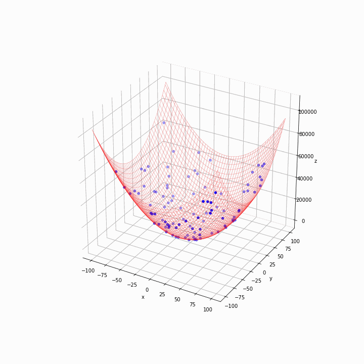

# Particle Swarm Optimization (PSO)
Particle Swarm Optimization is a powerful meta-heuristic optimization algorithm
and inspired by swarm behavior observed in nature such as fish and bird schooling.

This repository is an example of PSO using Python and Matplotlib.

## Result
